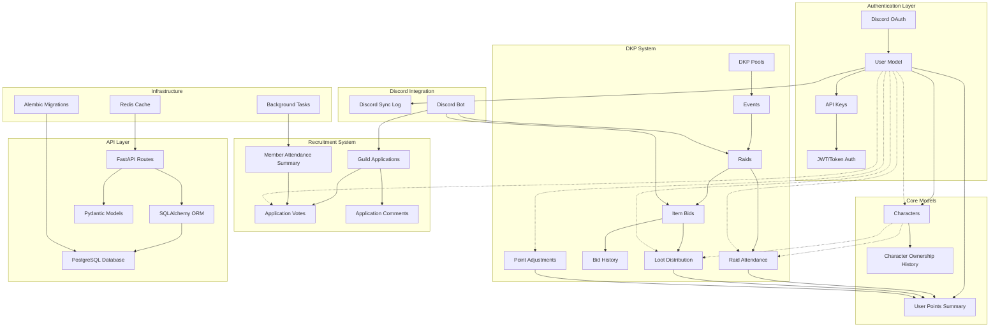
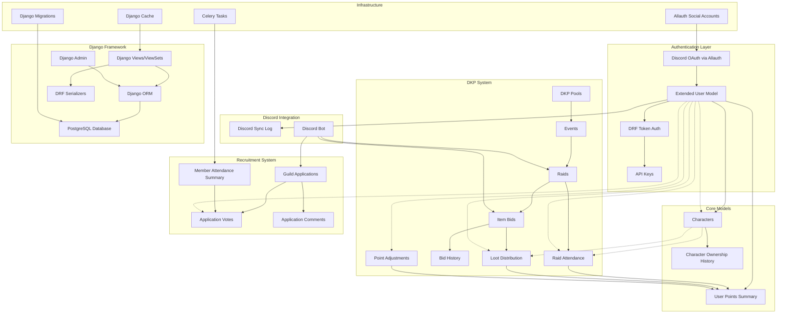

# EQ DKP System - Planning Repository

This repository contains the planning documentation and Entity Relationship Diagrams (ERDs) for an EverQuest Dragon Kill Points (DKP) system. The system is designed to support both Django and FastAPI implementations with Discord integration for user authentication and role management.

## Overview

The EQ DKP system is a guild management tool that tracks member participation in raids, manages point-based loot distribution, and handles recruitment applications. The system is built around Discord users rather than game characters to support character transfers and maintain point continuity.

## Key Features

- **Discord OAuth Integration**: Primary authentication method using Discord accounts
- **User-Centric Design**: Points and roles assigned to Discord users, not characters
- **Dynamic Loot Pricing**: All items distributed via bidding system (no fixed costs)
- **Comprehensive Attendance Tracking**: 30/60/90 day and lifetime attendance metrics
- **Recruitment Management**: Application workflow with member voting system
- **Character Transfer Support**: Character ownership can change without affecting user points

## Architecture Diagrams

### FastAPI Implementation Flow



### Django Implementation Flow



## Implementation Details

### Discord User-Centric Design

Both implementations follow a **Discord user-centric** approach where:

- **Points belong to Discord users**, not characters
- **Character names in transaction tables are snapshots** (no foreign key constraints)
- **Character ownership can be transferred** without affecting point balances
- **Roles and permissions are assigned to Discord users** through the `role_group` field

### Key Design Decisions

1. **No Character Ranks**: Characters do not have ranks, groups, or roles - only Discord users have role assignments
2. **Dynamic Item Pricing**: All items are distributed via bidding with no fixed costs
3. **Attendance-Based Voting**: Only members with ≥15% 30-day attendance can vote on applications
4. **Comprehensive Audit Trail**: All transactions maintain character name snapshots for historical reference

### Database Schema Highlights

- **User Model**: Extended with Discord integration fields and role management
- **Character Model**: Simplified to focus on character data without rank complexity
- **Points System**: Materialized views for efficient balance calculations
- **Bidding System**: Real-time validation against user DKP balances
- **Recruitment System**: Multi-stage workflow with attendance-based voting eligibility

## File Structure

```
├── README.md                      # This file
├── ERD_FastAPI_EQ_DKP.md         # FastAPI implementation ERD
├── ERD_Django_EQ_DKP.md          # Django implementation ERD
├── PRD_FastAPI_EQ_DKP.md         # FastAPI Product Requirements
├── PRD_Django_EQ_DKP.md          # Django Product Requirements
└── CLAUDE.md                     # Development context and workflow
```

## Development Workflow

This repository uses Task Master AI for project planning and task management. The `.taskmaster/` directory contains configuration and task definitions for automated development workflows.

### Getting Started

1. Review the ERD documentation for your chosen implementation (Django or FastAPI)
2. Set up Task Master AI following the instructions in `CLAUDE.md`
3. Use the PRD files to generate implementation tasks
4. Follow the database schema and business rules defined in the ERDs

## Business Rules Summary

### Core Principles
- Discord OAuth as primary authentication
- User-centric point and role management
- Dynamic loot pricing through bidding
- Character transfer support
- Comprehensive attendance tracking
- Automated Discord role synchronization

### Security & Access Control
- Role-based permissions (Officer, Recruiter, Developer, Member, Applicant, Guest)
- API key management for programmatic access
- Attendance-based voting eligibility
- Secure Discord bot integration

## Contributing

This is a planning repository. Implementation will be done in separate repositories based on the chosen framework (Django or FastAPI).

## License

TBD - Guild-specific implementation